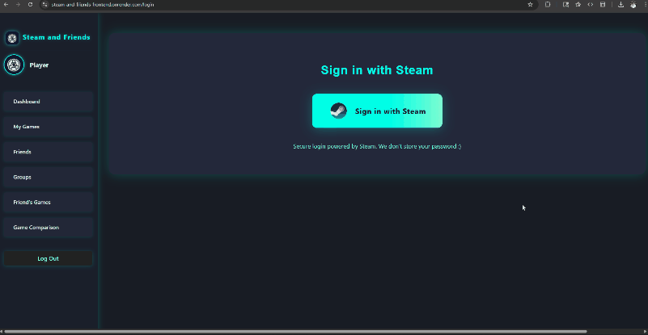
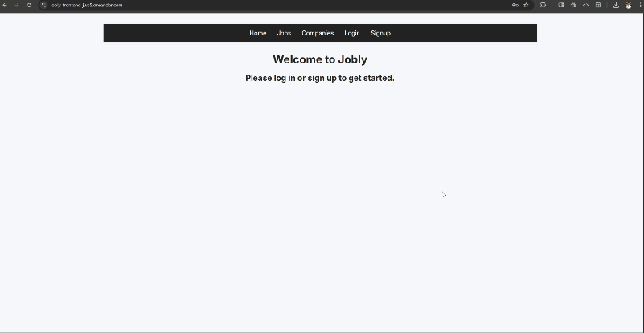

# Hi there 👋 I'm Dante Cancellieri

**Detail-oriented Software Engineer** building full-stack apps with **JavaScript, Python, React, Flask, and PostgreSQL**. 

Passionate about creating clean, maintainable code and delivering user-focused solutions.

<!-- ## 📊 GitHub Stats -->
<!--  -->

---

## 🛠 When I Code, I Rely On

  <!-- Frontend -->
  
  
  
  
  

  <!-- Backend -->
  
  
  
  

  <!-- Deployment / Infra -->
  
  
  
  

  <!-- Tools -->
  
  
  

---

## 💼 Featured Projects

### [Platform Party](https://platform-party.com/)
[Frontend Code →](https://github.com/dantec97/Game_Sync_3.0_frontend) | [Backend Code →](https://github.com/dantec97/Game_Sync_3.0_backend)  
*React, Flask, PostgreSQL*  

- **All-in-one social gaming platform** for effortless game night coordination across Steam, PlayStation, Xbox, Nintendo, mobile, and more
- **Universal Game Library:** Add any game from any platform, auto-sync with Steam & PSN
- **Cross-Platform Friends:** Connect with friends regardless of where they play
- **Smart Scheduling:** Set your availability, see group overlap, and plan game nights with timezone conversion
- **Group Coordination:** Create groups, chat, vote on games, and manage shared calendars
- **Customizable Dashboard:** Drag, resize, and arrange widgets for a personalized experience
- **Live Demo:** [Platform-Party.com](https://platform-party.com/)

### [Steam and Friends](https://steam-and-friends-frontend.onrender.com/)  
[Frontend Code →](https://github.com/dantec97/Steam-and-Friends-frontend) | [Backend Code →](https://github.com/dantec97/Steam-and-Friends-backend)  
*React, Flask, PostgreSQL*  

- Allows users to link their Steam account, sync games, create groups with friends, and compare common games  
- Full-stack gaming dashboard integrating Steam OpenID for authentication and real-time stats  
- Interactive Recharts visualizations for actionable insights  

---

### [Jobly](https://jobly-frontend-jwe5.onrender.com/)  
[Frontend Code →](https://github.com/dantec97/jobly-frontend) | [Backend Code →](https://github.com/dantec97/jobly-backend)  
*React, Node.js, PostgreSQL*  

- Full-stack job board app with secure RESTful APIs  
- User authentication, authorization, and schema validation  
- Automated tests and Render deployment  

---

### [ALP Website Redesign](https://alp.sandiegolan.net/index.html)  
[Frontend Code →](https://github.com/dantec97/alp.sandiegolan)  
*HTML, CSS, JavaScript*  

- Fully redesigned the front-end of the ALP website from raw HTML to polished, modern UI  
- Added responsive CSS styling and layout improvements for events and Comic-Con showcases  
- Optimized for fast loading and cross-browser compatibility  

---

## 🎓 Education

- **Software Engineering Certification** — Stony Brook University, NY *(June 2025)*  
- **Adobe Premiere Pro Certification** — Adobe *(Nov 2023)*  
- **B.S. Media Studies** — SUNY Oneonta *(2022)*  
- **Studio Recording Tech Certification** — Nassau Community College *(2017)*

---

## 📫 Connect with Me

- **GitHub:** [github.com/dantec97](https://github.com/dantec97)  
- **LinkedIn:** [linkedin.com/in/dantecancellieri](https://www.linkedin.com/in/dante-cancellieri/)  
- **Email:** dantecpriority@gmail.com

<!--
**dantec97/dantec97** is a ✨ _special_ ✨ repository because its `README.md` (this file) appears on your GitHub profile.

Here are some ideas to get you started:

- 🔭 I’m currently working on ...
- 🌱 I’m currently learning ...
- 👯 I’m looking to collaborate on ...
- 🤔 I’m looking for help with ...
- 💬 Ask me about ...
- 📫 How to reach me: ...
- 😄 Pronouns: ...
- ⚡ Fun fact: ...
-->
